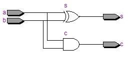

# Learn Verilog/SystemVerilog/HDL!


```verilog
module halfAdder (
    input       a, b,
    output      c, s
);
    assign s = a ^ b;
    assign c = a & b;

endmodule

module fullAdder (
    input       a, b, c,
    output      s, co
);
    wire tmp_s0, tmp_c0, tmp_c1;
    halfAdder ha0 ( .a  (a),
                    .b  (b),
                    .c  (tmp_c0),
                    .s  (tmp_s)
    );
    halfAdder ha1 ( .a  (tmp_s),
                    .b  (c),
                    .c  (tmp_c1),
                    .s  (s)
    );
    assign co = tmp_c0 | tmp_c1;
    
endmodule

a   ──┲━━━┱─tmp_c0─────────────┐
      ┃ha0┃                    ├─ or ──   co
b   ──┺━━━┹─tmp_s─┲━━━┱─tmp_c1─┘
                  ┃ha1┃
c   ──────────────┺━━━┹────────────────   s
```



Half Adder


Full Adder
