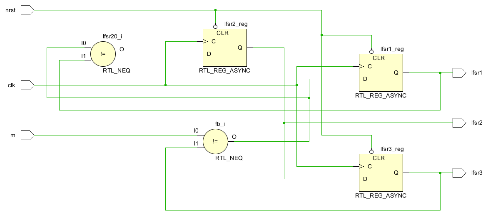
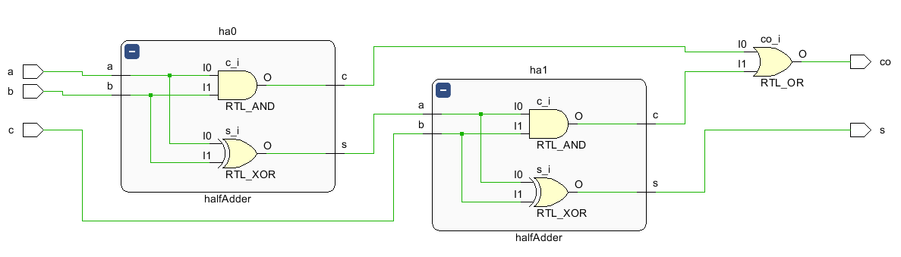
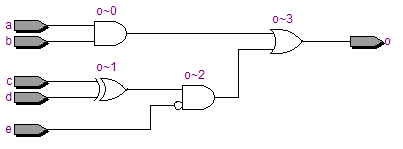
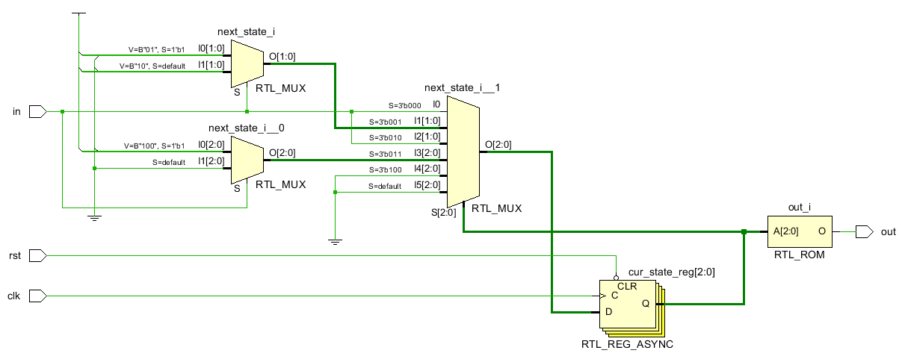
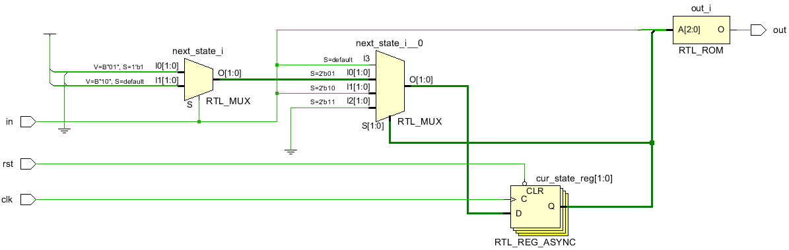

## Cyclic Modulo

<p align="center">

$$U^{(i)}(X)=X^iU(X)\mod(X^n+1)$$<\p>


# Learn Verilog/SystemVerilog/HDL!

### "assign" keyword

```verilog
/*
a   ──┲━━━┱─tmp_c0─────────────┐
      ┃ha0┃                    ├─ or ──   co
b   ──┺━━━┹─tmp_s─┲━━━┱─tmp_c1─┘
                  ┃ha1┃
c   ──────────────┺━━━┹────────────────   s
*/

module halfAdder (
    input       a, b,
    output      c, s
);
    assign s = a ^ b;
    assign c = a & b;

endmodule

module fullAdder (
    input       a, b, c,
    output      s, co
);
    wire tmp_s0, tmp_c0, tmp_c1;
    halfAdder ha0 ( .a  (a),
                    .b  (b),
                    .c  (tmp_c0),
                    .s  (tmp_s)
    );
    halfAdder ha1 ( .a  (tmp_s),
                    .b  (c),
                    .c  (tmp_c1),
                    .s  (s)
    );
    assign co = tmp_c0 | tmp_c1;
    
endmodule
```



### "always" block

```verilog
module exCombLogic (
    input       a, b, c, d, e,
    output  reg o
);
    always @ (a or b or c or d) begin
        o <= ((a & b) | (c ^ d) & ~e);
    end
     
endmodule
```



```verilog
module exTFF (
    input       clk,
                rst,
                d,
    output  reg q
);
    always @ (posedge clk or negedge rst) begin
        if (rst == 0)
            q <= 0;
        else
            if (d == 1)
                q <= ~q;
            else
                q <= q;
    end

endmodule
```


### mealy vs moore machine

Sequence(Binary 1011) Detector




